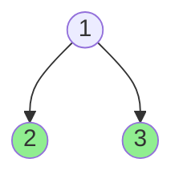
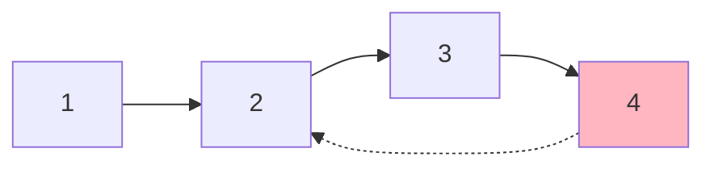
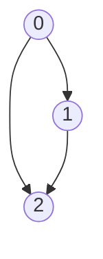
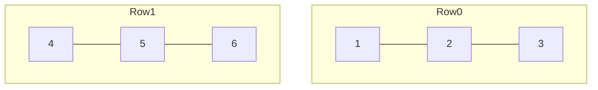

# AlgoCraft Diagram Generator

This directory contains Mermaid diagram definitions and scripts to generate PNG images for algorithm problems.

## Current Status

**55 diagrams created** covering:

- 🌳 Binary Trees (p81-p97, p476, etc.)
- 🔗 Linked Lists (p65-p77)
- 🕸️ Graphs (p130-p150)
- 📊 Matrices/Grids (p121, p124, p129, p132-p134, p148, p188-p189, p460)

## Directory Structure

```
scripts/diagrams/
├── README.md
├── package.json           # Node.js dependencies
├── generate.js            # Mermaid -> PNG conversion
├── auto_generate.js       # Auto-generate from problem JSON
└── mermaid/               # Mermaid source files (55 files)
    ├── p65_example1.mmd
    ├── p81_example1.mmd
    ├── p94_example1.mmd
    └── ...

question_bank/official/images/  # Generated PNG output
```

## Setup

```bash
cd scripts/diagrams
npm install
```

## Usage

### Generate all diagrams

```bash
npm run generate
```

### Generate specific problem

```bash
npm run generate -- --problem 94
```

### Watch mode (auto-regenerate on change)

```bash
npm run watch
```

## Output

Generated images are saved to:

```
question_bank/official/images/
├── p94_example1.png
├── p94_example2.png
└── ...
```

## Mermaid Syntax Guide

### Binary Tree



### Linked List



### Graph



### Grid/Matrix



## Contributing

1. Create `.mmd` file in `mermaid/` directory
2. Use naming convention: `p{problem_id}_{diagram_name}.mmd`
3. Run `npm run generate`
4. Update the problem JSON to reference the image

## JSON Reference Format

In problem JSON files, reference diagrams like this:

```json
{
  "diagrams": [
    {
      "id": "example1",
      "file": "p94_example1.png",
      "caption": "Binary tree [1,2,3]"
    }
  ]
}
```
